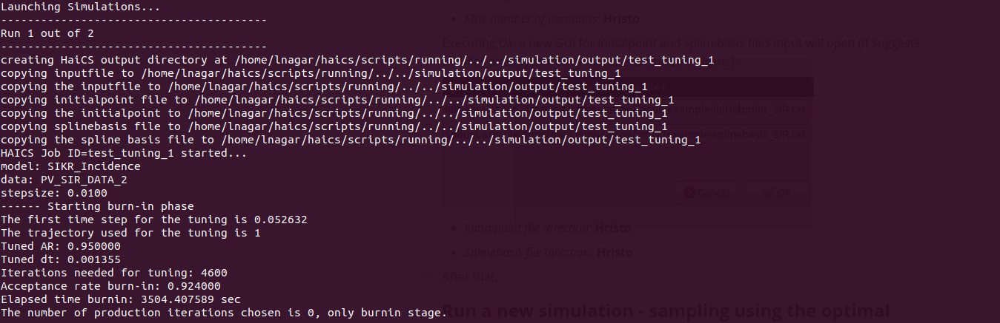

# A basic tutorial on HaiCS For Epidemics

## Table of Contents

1. [Introduction](#Introduction)
2. [Prerequisites](#Prerequisites)
3. [Running HaiCS on your local machine](#Running-HaiCS-on-your-local-machine)
4. [The main GUI screen](#main-GUI)
5. [Sampling a new run without tuning](#sampling-no-tuning)
6. [Sampling from a previous simulation](#sampling-rerun)
7. [Only tuning](#Only-tuning)
8. [Analysing and plotting results with R](#Analysing-plotting)
9. [References](#References)

## Introduction

**HaiCS (Hamiltonians in Computational Statistics)** is a [BCAM](https://www.bcamath.org/en) in-house software designed for the statistical sampling of high-dimensional and complex distributions and parameter estimation in Bayesian models utilizing Markov Chain Monte Carlo (MCMC) and Hamiltonian Monte Carlo (HMC) based methods. Detailed insights into HaiCS can be found in the foundational works of Radivojević (2016) and Radivojević & Akhmatskaya (2020).

### Core Design and Compatibility

The software uniquely combines C and R programming languages, striking a balance between computational efficiency and statistical robustness. The computational simulations are crafted in C, ensuring high performance, while the analytical aspects, including performance analysis and MCMC diagnostics, are conducted in R. HaiCS is specifically optimized for UNIX certified operating systems, catering to a broad range of computational environments.

### Application in Epidemiological Modeling

This repository provides the necessary code for running SIR/SEIR-like probabilistic models, particularly focusing on Incidence data, with a time-dependent transmission rate. Using a Bayesian approach, HaiCS employs HMC-based samplers to accurately infer epidemiological parameters, offering a powerful tool for understanding disease spread and control measures.

### Documentation and User Guide

This document serves as a comprehensive guide, presenting an overview of HaiCS's features and functionalities. It includes a step-by-step tutorial designed to assist users in effectively utilizing the software for their statistical and epidemiological research needs.

For further reading and detailed understanding, the foundational works of this software can be referred to in Radivojević (2016) and Radivojević & Akhmatskaya (2020).

### Prerequisites

Before starting, ensure you have installed the following prerequisites:

- **UNIX Operating System**: HaiCS is optimized for UNIX environments.
- **[GSL (GNU Scientific Library)](https://www.gnu.org/software/gsl/)**: Install using the command `sudo apt-get install libgsl-dev`.
- **[Sundials Library](https://computing.llnl.gov/projects/sundials/sundials-software)**: Essential for numerical solving ([Installation Guide](https://sundials.readthedocs.io/en/latest/Install_link.html)). Note: The installation directory (INSTDR) must be `/usr/local`.
- **[Yad (Yet Another Dialog)](https://github.com/v1cont/yad)**: Install with `sudo apt-get install yad`.
- **[R Programming Language](https://cran.r-project.org/)**: Required for running R scripts in HaiCS.

## HMC Contents

### Samplers

- **HMC (Hamiltonian Monte Carlo)**: Based on Duane et al. (1987) and Neal (2011).
- **GHMC (Generalized Hybrid Monte Carlo)**: As per Kennedy & Pendelton (2001).

### Models

- **SIR Model**: The standard Susceptible‐Infectious‐Recovered model as per Kermack & McKendrick (1927).
- **SIKR Model**: An SIR model with K infectious compartments (Anderson & Watson, 1980), featuring a time-dependent transmission rate (Inouzhe et al., 2023), parameterized using P-splines (Lang & Brezger, 2004).
- **SEMIKR Model**: An SEIR model with M exposed compartments and K infectious compartments (Anderson & Watson, 1980), incorporating a time-dependent transmission rate (Inouzhe et al., 2023), parameterized using P-splines (Lang & Brezger, 2004).

### Hamiltonian Dynamics Integrators

- **Velocity Verlet**: As described by Verlet (1967) and Swope et al. (1982).
- **Minimum Error**: Following McLachlan (1995) and Predescu et al. (2012).
- **BCSS Integrator**: Developed by Blanes et al. (2014).
- **s-AIA Integrator**: Presented by Nagar et al. (2023).

## HaiCS Folder Structure

- `haics`: Main HaiCS directory.
  - `haics.sh`: Bash script to start HaiCS.
  - `output`: Stores simulation outputs.
  - `README.md`: This tutorial.
  - `script`: Bash and R scripts for HaiCS operation.
    - `plotting_epidem_outputs`: R scripts for analyzing and plotting simulation outputs.
    - `running`: Bash scripts for local simulations.
    - `sampling_optimal_setting`: Scripts for optimal HMC parameter settings.
  - `simulation`: Files for simulations.
    - `benchmark`: Benchmark data for epidemiological models.
    - `bin`: HaiCS executables.
    - `input`: Input file examples and [tables for s-AIA integrator](https://data.mendeley.com/datasets/5mmh4wcdd6/1).
    - `objects`: Generated C objects from source files.
    - `output`: Temporary simulation output storage.
    - `src`: C source files.
  - `tutorial`: Image files for this tutorial.

## Running HaiCS

### Starting HaiCS

To initiate HaiCS on your device:

1. **Download the Repository**: Ensure you have the entire HaiCS repository downloaded to your local device.
2. **Navigate to the HaiCS Directory**: Open a terminal and change your directory to `haics`, where the `haics.sh` script is located.
3. **Launch the Script**: Execute `./haics.sh` to start HaiCS. This will open the Graphical User Interface (GUI).

### The Main GUI Screen

Upon executing `./haics.sh`, the following GUI appears:


#### GUI Components:

- **Re-run old simulation or new?**: Choose to either start a new simulation or rerun a previous one completed with HaiCS.

- **Simulation Name**: Enter the name for your new simulation. This will also be the name of the directory in `haics/output` where the simulation outputs are stored.

- **Sampler (See Samplers Section)**: Select the MCMC sampler based on Hamiltonian dynamics:
  - HMC
  - GHMC

- **Compartmental Model (See Models Section)**: Choose the epidemiological compartmental model for the HMC/GHMC sampling:
  - SIR_standard - The standard SIR model.
  - SIKR_spline - The SIKR model.
  - SEMIKR_spline - The SEMIKR model.

- **Data**: Select the epidemiological data set for the simulation. Example datasets are available in `haics/simulation/benchmarks`. To add a new dataset (`NEW_DATASET`), place it in `haics/simulation/benchmarks` as `NEW_DATASET_data.txt`.

- **Action**: Define the type of simulation strategy:
  - Tuning: Conduct a burn-in stage with the chosen model and sampler to determine appropriate (G)HMC parameters (Nagar et al., 2023) for the sampling/production stage.
  - Sampling: Execute a production stage with the selected model and sampler to track the trajectory of the inferred parameters.

- **Re-use the code?**: Choose whether to recompile the HaiCS source code for the next simulation.

## Run a New Simulation - Tuning Optimal Parameters Setting

### Initiating a New Simulation

To start a new simulation from scratch:

1. **Select Simulation Type**: In the main GUI, choose *new* for the option *Re-run old simulation or new?*.

2. **Burn-in Stage Recommendation**: For optimal parameter setting in the sampling stage, we recommend running a burn-in stage (*action = tuning*). It's advisable to use the default GUI entries, as they are designed to replicate the tuning algorithm described in (Nagar et al., 2023).

3. **First-time Users**: If running HaiCS for the first time, select *Re-use the code? = no* to compile the source code.


The above settings initiate a burn-in stage named *test_tuning* using the GHMC sampler with Basque Country data for the SIKR model, including source code compilation.

### Configuring Burn-in Stage

Upon executing *Ok*, the following GUI appears for burn-in stage settings:


- **Number of Iterations**: Total number of iterations for the burn-in stage.
- **Iteration for Tuning a Stepsize**: Iterations allocated for tuning the target AR (default 0.95).
- **Number of Chains**: Specify the number of chains to run (minimum of 1).

For GHMC sampler selection, a GUI for GHMC parameters appears:


- **Noise Parameter (Phi) (0, 1]**: Random noise for Partial Momentum Update (PMU) in GHMC.
- **Type of Phi**: Randomization scheme for Phi:
  - *constant*: Fixed value as chosen above.
  - *unif(0,Phi)*: Randomly sampled within *(0, Phi)*.

### Setting General Parameters for SIKR/SEMIKR Model

The next GUI sets general parameters:


- **Number of Spline Basis**: Specifies the number of spline bases used to model the time-dependent transmission rate.

- **Degree of Spline Polynomial**: Determines the degree of the polynomials used in the splines. Currently, only a degree of 3 is supported.

- **Final Time for the Spline Basis**: Indicates the final time of interest for the spline basis, usually the last day of the period under study.

- **Time Points Returned by CVODES**: The number of time points the ODE solver (CVODES) returns. This should typically match the 'Final Time for the Spline Basis'.

- **Mean for Gaussian Prior on Initial Number of Infected (I0)**: The mean of the Gaussian prior applied to the initial number of infected individuals (I0).

- **Standard Deviation for Gaussian Prior on I0**: The standard deviation corresponding to the Gaussian prior on I0.

- **Mean for Gaussian Prior on Gamma**: The mean of the Gaussian prior for gamma, representing the inverse of the average infectious period.

- **Standard Deviation for Gaussian Prior on Gamma**: The standard deviation corresponding to the Gaussian prior on gamma.

- **Lambda for Exponential Prior on Overdispersion (Phi Inv)**: The rate parameter for the exponential distribution prior applied to the negative binomial overdispersion parameter.

- **Shape for Inverse Gamma Prior on Spline Roughness (Tau)**: The shape parameter for the inverse gamma prior, typically used for the roughness parameter of Bayesian splines.

- **Scale for Inverse Gamma Prior on Spline Roughness (Tau)**: The scale parameter corresponding to the inverse gamma prior on spline roughness.

- **Number of Infectious Compartments**: The total number of compartments (including all subcompartments) in the infectious (I) compartment.

- **Gamma Upper Bound (GammaU)**: The upper limit for the gamma parameter, the inverse of the average infectious period.

- **Gamma Lower Bound (GammaL)**: The lower limit for the gamma parameter.

---

These parameters play a crucial role in customizing the simulation models in HaiCS, allowing for detailed and specific epidemiological analysis.

### Model-Specific Parameter Configuration

Depending on the chosen compartmental model, additional GUIs provide model-specific parameters:

- **SEMIKR Model**:

  

  - **Mean for Gaussian Prior on Alpha**: This is the mean of the Gaussian prior for the rate of transition between the Exposed (E) and Infectious (I) compartments. This parameter helps in defining the central tendency of the transition rate in the model.

  - **Standard Deviation for Gaussian Prior on Alpha**: The corresponding standard deviation for the Gaussian prior on the alpha parameter. It determines the spread or variability around the mean value of the transition rate.

  - **Number of Exposed Compartments**: Specifies the total number of compartments (including all subcompartments) that the exposed (E) compartment will have. This parameter allows for a more granular modeling of the disease progression stages before individuals become infectious.

- **Standard SIR Model**:

  

  - **Mean for Gaussian Prior on Beta**: This is the mean of the Gaussian prior for the infection transmission rate, which governs the transition between the Susceptible (S) and Infectious (I) compartments. This parameter is crucial for setting the expected average rate of infection transmission within the population.
  
  - **Standard Deviation for Gaussian Prior on Beta**: The corresponding standard deviation for the Gaussian prior on the beta parameter. It defines the variability or uncertainty around the mean transmission rate, reflecting the expected fluctuations in how rapidly the infection spreads.
  

No additional GUI for the SIKR model.

### Accounting for Underreporting

The following GUI addresses underreporting options:


- **Account for Undereport**: If set to 1 (yes), this option assumes underreporting in the epidemiological data. The underreporting is modeled as a piecewise function with a constant value, linear interpolation, and then constant again, based on two data points where actual underreporting is measured.

- **Time of 1st Measurement of Underreport**: This is the first time point at which underreporting was measured. It marks the beginning of the period where underreporting data is available and is used to model the initial constant phase and the beginning of the linear interpolation phase.

- **1st Value of Undereport (Fraction of Detected Cases)**: This represents the fraction of total cases that were actually reported at the first measurement time point. It is a value between 0 and 1, with 1 indicating no underreporting and values closer to 0 indicating higher levels of underreporting.

- **Time of 2nd Measurement of Underreport**: This is the second time point where underreporting was measured. It signifies the end of the linear interpolation phase and the beginning of the final constant phase in the underreporting model.

- **2nd Value of Undereport (Fraction of Detected Cases)**: Similar to the first value, this is the fraction of total cases actually reported at the second measurement time point. It ranges between 0 and 1, with lower values indicating greater underreporting.

### Gradient Descent Options

A GUI for gradient descent appears for further refinement:


- **Perform Gradient Descent?**: If set to 1, this initiates a gradient descent process on the log-posterior to enhance the initialization phase. This step is particularly useful when plausible starting values for the parameters are not readily available or are uncertain. It helps in finding a more optimal starting point for the simulation.

- **Learning Rate**: This is a crucial parameter for the gradient descent algorithm. It determines the size of the steps taken towards the minimum of the log-posterior. A higher learning rate can lead to faster convergence but may overshoot the minimum, while a lower rate ensures more precise convergence but requires more iterations.

- **Max Number of Iterations**: This defines the total number of steps that the gradient descent algorithm will take following the gradient. It sets a limit to the convergence process, ensuring that the algorithm stops after a specified amount of iterations, regardless of whether the minimum has been reached.

### Setting Initial Points and Spline Basis

The final GUI allows setting initial points and spline basis:


- **Initialpoint File Direction**: This should be the path to a text file that contains the initial values for the parameters specific to the SEMIKR model (that we chose previously). These parameters typically include **alpha, gamma, I0, phi inv,** and **tau**. The file should be structured to provide these values in a format that HaiCS can interpret, setting the starting point for each parameter in the model's simulation.

- **Splinebasis File Direction**: This parameter requires the path to a file that contains the initial values for the spline basis. If, for example, 15 spline bases are chosen to model the time-dependent transmission rate, this file should contain 15 initial values corresponding to each spline basis. This file essentially sets up the initial structure of the spline model, which is crucial for accurately capturing the dynamics of the transmission rate over time.

### Simulation Progress and Output

After configuration, HaiCS compiles the source code and begins the simulation. The terminal displays the simulation progress:



Upon completion, find the results in `haics/output/SIMULATION_NAME`, including an `input` folder (with input files) and folders for each simulated chain.

## Run a New Simulation - Sampling Using the Optimal (G)HMC Parameters Setting

### Initiating the Production Stage

After completing the burn-in stage, users can proceed to the production stage, employing the optimal (G)HMC parameters as suggested in Inhouze et al. (2023) and Nagar et al. (2023):

1. **Start HaiCS**: Follow the initial steps outlined in the previous section to launch HaiCS.

2. **Select Simulation Type**: Choose *Re-run old simulation or new? = new*.

3. **Name the Production Stage Simulation**: Assign a name for this stage of the simulation.

4. **Choose Action**: Set *action = sampling*. The additional fields will auto-populate based on the output from the burn-in stage.

5. **Reuse Code Option**: If there have been no changes to the source code since the burn-in stage, select *Re-use the code? = yes*.


### Setting Up Automatic Tuning

Executing *Ok* will open a GUI for automatic tuning:


- **Confirm Automatic Tuning**: Choose *yes* and proceed by clicking *Ok*. This step will allow you to select the number of iterations for the sampling process.


### Selecting the Burn-in Stage

Next, choose the burn-in stage simulation that you previously completed. This step ensures that the production stage builds upon the optimized parameters established during the burn-in:


### Monitoring Simulation Progress

- **Simulation Progress**: The progress of the simulation will be displayed in the terminal. 

### Accessing Simulation Results

Upon completion of the simulation:

- **Results Location**: Find the results in `haics/output/SIMULATION_NAME`.
- **Contents of Result Folder**: The `input` folder contains input files ((G)HMC settings, initial points, and spline basis). There will be as many `SIMULATION_NAME_*` folders as the number of simulated chains, each containing the outputs of the respective chain.

## Run a New Simulation from Scratch

### Starting a Fresh Simulation

Users have the option to initiate a simulation without using the optimal (G)HMC parameters from the burn-in stage. Follow these steps:

1. **Initialize HaiCS**: Launch HaiCS and select *Re-run old simulation or new? = new*.

2. **Simulation Setup**: Choose a simulation name, model, sampler, dataset, and set *action = sampling*.

3. **Optimal Parameters Setting**: Select *Automatic optimal parameters setting from the tuning stage = no*.

   

### Specifying Simulation Parameters

4. **Iterations and Chains**: Input the desired number of iterations and chains for the simulation.

5. **HMC Parameters Setting**: In the following GUI, specify the HMC parameters:

   

   - **Integrator**: Choose the integration scheme from the options listed under **Hamiltonian dynamics integrators**.
     - **1sVV (1-stage Velocity Verlet)**.
     - **2sVV (2-stage Velocity Verlet)**.
     - **2sBCSS-HMC (2-stage BCSS)**.
     - **2sMinError-HMC (2-stage Minimum Error)**.
     - **2sAIA-HMC (2-stage s-AIA)**.
     - **3sBCSS-HMC (3-stage BCSS)**.
     - **3sMinError-HMC (3-stage Minimum Error)**.
     - **3sAIA-HMC (3-stage s-AIA)**.

   - **Trajectory Length L**: Specify the number of Hamiltonian dynamics integrations per iteration.
   - **Type of L**: Select the randomization scheme for trajectory length (constant or uniform).
     - **Constant**: The stepsize is fixed and equal to the value *L*.
     - **unif(1,L)**: The stepsize is sampled uniformly in the range *(1,L)*.
   - **Stepsize**: Set the step size for the numerical integrators.
   - **Type of Stepsize**: Choose the randomization scheme for the integration step size.
     -   **Constant**: The stepsize is fixed and equals the value given in the previous input.
     -   **N(stepsize, 0.0025 stepsize^2)**: The stepsize is sampled from a Gaussian distribution N(stepsize, 0.0025 * stepsize^2).
     -   **unif(stepsize-stepsize_delta,stepsize)**: The stepsize is sampled uniformly in the range (stepsize - stepsize_delta, stepsize), where stepsize_delta can be specified below.
     -   **unif(stepsize,stepsize+stepsize_delta)**: The stepsize is sampled uniformly in the range (stepsize, stepsize + stepsize_delta), where stepsize_delta can be specified below.
     -   **unif(stepsize-stepsize_delta,stepsize+stepsize_delta)**: The stepsize is sampled uniformly within (stepsize - stepsize_delta, stepsize + stepsize_delta), where stepsize_delta can be specified below.
   - **Thinning**: Define how much the (G)HMC chains should be thinned out before storage. Default is 1 (store at each iteration).
   - **Stepsize Delta**: Set the randomization step for certain stepsize schemes.
   - **Fitting Factor**: Relevant for s-AIA integrators; refer to (Nagar et al., 2023) or the [Mendeley Data repository](https://data.mendeley.com/datasets/5mmh4wcdd6/1) for details.

   If **Sampler = GHMC** is selected, an additional GUI will prompt for PMU parameters.

6. **Model Parameters and Initial Points**: As previously detailed in **Run a new simulation - tuning optimal parameters setting**, choose the model parameters and initial points.

### Running and Accessing Simulation Results

- **Start Simulation**: After completing the setup, HaiCS will commence the simulation.
- **Progress Monitoring**: Track the simulation's progress through the terminal.
- **Results Location**: Upon completion, find the results in `haics/output/SIMULATION_NAME`.
- **Results Contents**: The `input` folder contains all input files ((G)HMC settings, initial points, and spline basis). Additionally, there will be as many `SIMULATION_NAME_*` folders as the number of simulated chains, each containing the respective outputs.

## Run an old simulation

After a simulation has already been run once (or more) with HaiCS and its corresponding output folder is still present in `haics/output`, you can re-run it by following these steps:

1. Select *re-run old simulation or new? = old* (without changing the other entries).


2. Execute *Ok*, and HaiCS will search for the folders in `haics/output`. You can then choose the simulation folder that you want to re-run.


3. The simulation will be re-run with the same name, and the files and folders of the old simulation will be moved to `haics/output/LOCAL_TRASH`.

After the re-run finishes, you can find the new results in `haics/output/SIMULATION_NAME`.

## Analysis and Plotting of Epidemic Model Outputs with R

In the directory `haics/scripts/plotting_epidem_outputs`, we provide a comprehensive R script designed for analyzing and visualizing the outputs from epidemiological simulations with HaiCS. An example can be found in `haics/output/SEI3R_Euskadi_paper`. There, we implemented a finely-tuned SEI3R sampling procedure, conducted over two chains, incorporating a burn-in phase of 1000 steps followed by a production phase of 10000 steps.

### Data and Input Details

For detailed information about the simulation parameters and data, please refer to the `haics/output/SEI3R_Euskadi_paper/input` directory. 

### Script Usage and Documentation

The main script for analysis, `plotting_epidem_outputs/AnalysisHaicsResults.R`, is extensively documented with comments to facilitate understanding and adaptation. These comments provide insights into the script's functionality and guide users through the analysis process.

### Getting Started

To begin the analysis:

1. **Load Additional Data**: First, load all the necessary data from the `.RData` files located in the `plotting_epidem_outputs` folder.
2. **Source the Analysis Function**: Next, source the `AnalysisHaicsResults` function. This function is essential for initiating the plotting procedure.

```R
load("HAICS_DOWNLOAD_FOLDER/haics/scripts/plotting_epidem_outputs/time_bassis_EUS_2.RData")
load("HAICS_DOWNLOAD_FOLDER/haics/scripts/plotting_epidem_outputs/corrected_Data_PV.RData")
load("HAICS_DOWNLOAD_FOLDER/haics/scripts/plotting_epidem_outputs/non_pharm_measures.RData")
source("HAICS_DOWNLOAD_FOLDER/haics/scripts/plotting_epidem_outputs/AnalysisHaicsResults.R")
```

## Running the Analysis Script

To execute the analysis, run the `AnalysisHaicsResults` function with the following parameters:

```R
AnalysisHaicsResults(
    file_directory = "HAICS_DOWNLOAD_FOLDER/haics/output/SEI3R_Euskadi_paper", # Directory containing HaiCS outputs
    file_name = "SEI3R_Euskadi_paper", # Name of the simulation run by HaiCS
    chains = 2, # Number of chains used in HaiCS
    burnin = 1000, # Burn-in steps in the Hamiltonian-based MCMC sampling
    time_basis = time_basis_EUS_2, # B-spline basis function values evaluated at time points of interest
    n_var = 20, # Number of parameters for posterior distribution (parameters sampled in MCMC)
    model_type = "SEIR",
    neq = 7, # Number of equations in the epidemiological model (SEI3R with an extra incidence compartment)
    npop = 2185605, # Total susceptible population size
    ndata = 357, # Sample size of observed incidence data
    gamma_bounds = c(1 / 30, 1), # Limits for the gamma (inverse average infectious time) parameter
    Incidence_data = Incidence_Data, # Data frame with Date, Cases, and Modif_Cases
    measures = medidas_cierre_apertura, # Data frame with Measure, Date, and Colour for plotting
    do_plot = TRUE, # Set to TRUE to display plots
    syn_data = FALSE, # Set to TRUE if using synthetic data (plots true values for reference)
    plotTitle = "SEI3R", # Indicates the type of compartmental model used
    chain_analysis = FALSE # Set to TRUE to perform convergence analysis of the chains
)
```

### Example Output Plots

Upon running the script, you will obtain various plots, including:

1. **Time-Dependent Basic Reproduction Number**: This plot visualizes the changes in the basic reproduction number over time.
   
   

2. **Posterior Predictive Check**: This plot offers a check of the posterior predictive distribution against observed data.

   

These plots provide valuable insights into the model's dynamics and the effectiveness of the epidemiological interventions.

## References

- S. Blanes, F. Casas, J. M. Sanz-Serna, Numerical integrators for the Hybrid Monte Carlo method, SIAM Journal on Scientific Computing 36 (4), A1556–A1580 (2014). [doi:10.1137/130932740](https://doi.org/10.1137/130932740).

- S. Duane, A. Kennedy, B. J. Pendleton, D. Roweth, Hybrid Monte Carlo, Physics Letters B 195 (2) (1987) 216–222. [doi:10.1016/0370-2693(87)91197-X](https://doi.org/10.1016/0370-2693(87)91197-X).

- H. Inouzhe, M. X. Rodríguez-Álvarez, L. Nagar, E. Akhmatskaya, Dynamic SIR/SEIR-like models comprising a time-dependent transmission rate: Hamiltonian Monte Carlo approach with applications to COVID-19, arXiv preprint, arXiv:2301.06385 (2023). [doi:10.48550/arXiv.2301.06385](https://doi.org/10.48550/arXiv.2301.06385).

- W. O. Kermack, A. G. McKendrick, A contribution to the mathematical theory of epidemics, Proceedings of the Royal Society of London 115 (772) (1927) 700–721. [doi:10.1098/rspa.1927.0118](https://doi.org/10.1098/rspa.1927.0118).

- S. Lang, A. Brezger, Bayesian P-Splines, Journal of Computational and Graphical Statistics, 13 (1):183–212 (2012). [doi:10.1198/1061860043010](https://doi.org/10.1198/1061860043010).

- R. I. McLachlan, On the Numerical Integration of Ordinary Differential Equations by Symmetric Composition Methods, SIAM Journal on Scientific Computing 16 (1) (1995) 151–168. [doi:10.1137/0916010](https://doi.org/10.1137/0916010).

- L. Nagar, M. Fernández-Pendás, J. M. Sanz-Serna, E. Akhmatskaya, Adaptive multi-stage integration schemes for Hamiltonian Monte Carlo. arXiv preprint, arXiv:2307.02096, (2023). [doi:10.48550/arXiv.2307.02096](https://doi.org/10.48550/arXiv.2307.02096).

- R. M. Neal, MCMC using Hamiltonian dynamics, Handbook of Markov Chain Monte Carlo, 2 (11) 2 (2011). [doi:10.1201/b10905](https://doi.org/10.1201/b10905).

- C. Predescu, R. A. Lippert, M. P. Eastwood, D. Ierardi, H. Xu, M. Ø. Jensen, K. J. Bowers, J. Gullingsrud, C. A. Rendleman, R. O. Dror, D. E. Shaw, Computationally efficient molecular dynamics integrators with improved sampling accuracy, Molecular Physics 110 (9-10) (2012) 967–983. [doi:10.1080/00268976.2012.681311](https://doi.org/10.1080/00268976.2012.681311).

- T. Radivojević, Enhancing Sampling in Computational Statistics Using Modified Hamiltonians, Ph.D. thesis, UPV/EHU, Bilbao (Spain) (2016). [doi:20.500.11824/323](https://doi.org/20.500.11824/323).

- T. Radivojević, E. Akhmatskaya, Modified Hamiltonian Monte Carlo for Bayesian inference, Statistics and Computing 30 (2) (2020) 377–404. [doi:10.1007/s11222-019-09885-x](https://doi.org/10.1007/s11222-019-09885-x).

- W. C. Swope, H. C. Andersen, P. H. Berens, K. R. Wilson, A computer simulation method for the calculation of equilibrium constants for the formation of physical clusters of molecules: Application to small water clusters, The Journal of Chemical Physics 76 (1) (1982) 637–649. [doi:10.1063/1.442716](https://doi.org/10.1063/1.442716).

- L. Verlet, Computer "Experiments" on Classical Fluids. I. Thermodynamical Properties of Lennard-Jones Molecules, Phys. Rev. 159 (1967) 98–103. [doi:10.1103/PhysRev.159.98](https://doi.org/10.1103/PhysRev.159.98).

-  D. Anderson, R. Watson. On the spread of a disease with gamma distributed latent and infectious periods. Biometrika, 67 (1980) 191–198. https://doi.org/10.1093/biomet/67.1.191.
